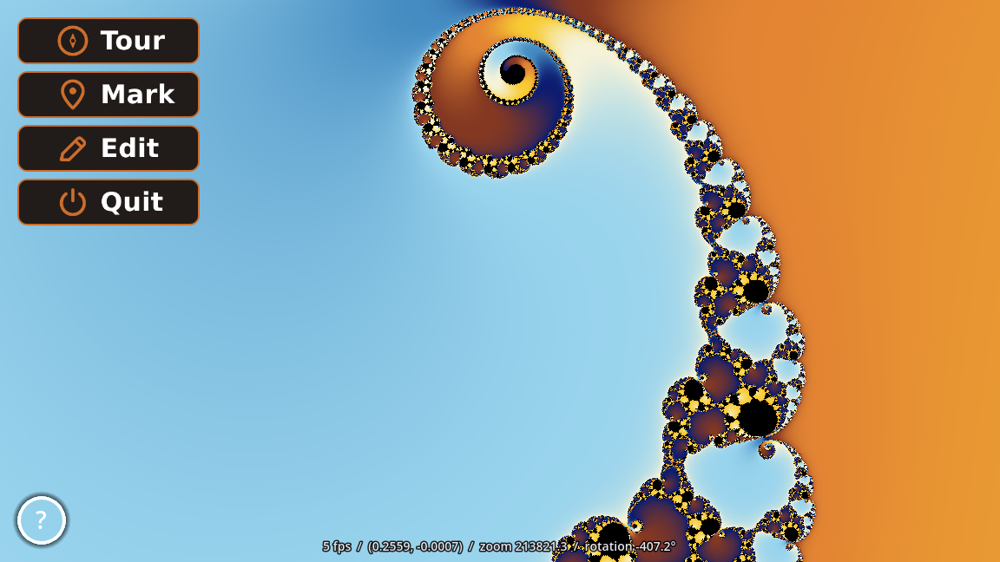

# Godot Mandelbrot Viewer With Android Support


A real-time Mandelbrot set explorer built with Godot 4.7 and .NET 8 (C#), rendered
entirely in a fragment shader with pan, zoom, rotation, a scripted tour of
documented locations in the set, and a fully custom UI (buttons, dialogs, theme)
built entirely in code. Runs on Windows, Linux, and Android.

## Features

- Full-screen Mandelbrot rendering (`resources/shaders/mandelbrot.gdshader`) with
  smooth, continuous escape-time coloring - no banding between iteration levels -
  using a custom color palette sampled from a reference image.
- Interactive pan, zoom, and rotation on both desktop and Android - rotation is
  compensated for so panning always tracks what looks right on screen, regardless
  of current rotation. Zooming out is capped at the default view.
- **Tour mode**: plays a scripted flight (hold/zoom-out/pan/zoom-in/hold, with
  synchronized rotation) through a series of points of interest, fully editable:
  - **Mark** captures the current view (position, zoom, rotation) as a new stop.
  - **Edit** opens a tour editor: drag stops to reorder them, jump straight to
    one, delete it, adjust tour playback speed (0.25x-4x), or reset the whole
    tour back to its defaults.
  - Tour stops and playback speed are saved between runs.
  - After 10 seconds of an uninterrupted tour, the buttons, stats readout, and
    (on desktop) the mouse cursor hide for an unobstructed view - any touch or
    mouse activity brings them back immediately.
- **Help dialog**: platform-specific instructions (mouse/keyboard controls on
  desktop, touch gestures on Android), shown automatically the first time the
  app is ever run and reachable anytime after via the "?" button in the
  bottom-left corner.
- A fully custom UI built in code rather than `.tscn` markup: SVG icon buttons, a
  shared theme, and a hand-built draggable/resizable dialog window used for both
  the tour editor and the help dialog - dialogs dim and block input to the rest
  of the app while open, and can be dismissed by clicking/tapping outside them or
  pressing Escape. Buttons flash briefly on click, and a toast notification
  confirms when a new tour marker is captured.
- Framerate throttling (5 FPS idle, 60 FPS while interacting, touring, a dialog
  is open, or a click-flash/toast animation is running) to keep power draw down
  on battery-powered devices.
- Android-specific tuning: pinch/pan zoom jumps directly to its target instead of
  animating, to keep frame time low on mobile GPUs.



## Requirements

- [Godot 4.7](https://godotengine.org/) with .NET/C# support (Mono build)
- [.NET 8 SDK](https://dotnet.microsoft.com/)
- For Android builds: Godot's Android export templates (matching version) and the
  Android SDK/`adb` on your `PATH`

## Controls

**Desktop (mouse):**

| Action | Control |
|---|---|
| Pan | Left-click drag |
| Zoom | Mouse wheel |
| Rotate | Hold Ctrl + drag (horizontal movement only) |
| Reset rotation | Double-click |

**Android (touch):**

| Action | Control |
|---|---|
| Pan | One-finger drag |
| Zoom | Two-finger pinch |
| Rotate | Three-or-more-finger drag |
| Reset rotation | Double-tap |

**Keyboard shortcuts:**

| Key | Action |
|---|---|
| F1 | Toggle fullscreen |
| F2 | Save a screenshot to `docs/snapshot.png` |
| F3 | Export the current tour points as C# source (dev use) |
| Escape | Close the open dialog, or quit if none is open |

Zooming out is capped at the full default view (zoom level 1) in all cases.

The top-left button stack is **Tour**, **Mark**, **Edit**, then **Quit**; while
touring, Mark/Edit hide and Quit moves up directly below Tour. The **?** button
in the bottom-left corner opens the help dialog.

## Running

Open the project in the Godot editor and run it directly for Windows/Linux.

For Android:

```sh
./build.sh          # builds the Android app
./deploy.sh          # installs to a USB-connected device
./deploy-wifi.sh     # installs to a device over Wi-Fi (adb)
```

## Building release versions

Release (non-debug) exports for all three platforms are pre-configured in
`export_presets.cfg` and can be built entirely from the CLI, no editor needed:

```sh
godot --headless --export-release "Windows Desktop" builds/windows/mandelbrot.exe
godot --headless --export-release "Linux" builds/linux/mandelbrot.x86_64
godot --headless --export-release "Android" builds/android/mandelbrot.apk
```

## Project layout

- `Main.tscn` / `Main.cs` - the scene root and all pan/zoom/rotation/tour/UI logic
- `DraggableWindow.cs` - the custom draggable/resizable dialog window base class
  used for the tour editor and help dialog
- `TourPointRow.cs` - a single row in the tour editor's point list
- `ButtonFlash.cs` - the white click-flash feedback shared by every button
- `resources/shaders/mandelbrot.gdshader` - the Mandelbrot fragment shader
- `resources/themes/minimal.tres` - the shared UI theme
- `resources/buttons/` - SVG button art (normal/hover/pressed/disabled per button)
- `resources/help/pc.txt` / `android.txt` - BBCode help dialog text, per platform
- `project.godot` - Godot project settings
